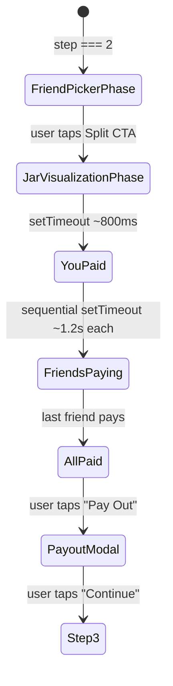

# Design Document: Onboarding Split Step Pixel-Perfect

## Overview

This feature replaces the simplified Step 2 in `OnboardingScreen.tsx` with a two-phase experience that exactly replicates the real product screens:

1. **Friend Picker Phase** — mirrors `SplitScreen.tsx` layout (amount input, description, pill-shaped friend toggles)
2. **Jar Visualization Phase** — pixel-perfect replica of `YutoGroupScreen.tsx` SVG graph (380×420 viewBox, 190,210 center, 185px radius, 76px nodes, orbit ring, rope lines with flowing dots, jar with YutoLogo, green glow on paid nodes)

After all simulated members pay, a payout modal explains where collected funds can go, then transitions to Step 3.

All data is hardcoded (Salah, Amina, Brian). No API calls, no supabase imports. Timer-based animations simulate the payment sequence.

## Architecture

The implementation lives entirely within `OnboardingScreen.tsx` as additional state and conditional rendering in the existing `step === 2` branch. No new files or components are created — the feature reuses existing shared assets (`YutoLogo`, CSS keyframes `orbitSpin`, `nodeGlow`, `nodeSnapIn` from `index.css`).



### Design Decisions

1. **Inline implementation** — No extracted sub-components. The onboarding screen is a single-use flow; extracting components adds indirection without reuse benefit.
2. **Reuse existing CSS keyframes** — `orbitSpin`, `nodeGlow`, and `nodeSnapIn` are already defined in `index.css` and used by `YutoGroupScreen`. We reference them directly.
3. **YutoLogo component** — Imported from `../components/YutoLogo` to render the jar center logo, matching the real screen exactly.
4. **Hardcoded jar corners** — The four rope anchor points `[230,162], [150,258], [150,162], [230,258]` are constants matching `YutoGroupScreen.tsx`.

## Components and Interfaces

### State Additions (within OnboardingScreen)

```typescript
// Phase within step 2
const [splitSubPhase, setSplitSubPhase] = useState<"picker" | "jar">("picker");

// Friend picker state
const [splitAmount, setSplitAmount] = useState("2400");
const [splitDescription, setSplitDescription] = useState("Friday Dinner 🍕");
const [selectedDemoFriends, setSelectedDemoFriends] = useState<string[]>(["salah", "amina", "brian"]);

// Jar visualization state (replaces current splitPhase number)
const [paidMembers, setPaidMembers] = useState<Set<string>>(new Set());
const [showPayoutModal, setShowPayoutModal] = useState(false);
```

### Demo Friend Data

```typescript
const DEMO_FRIENDS = [
  { id: "salah", name: "Salah", initial: "S" },
  { id: "amina", name: "Amina", initial: "A" },
  { id: "brian", name: "Brian", initial: "B" },
] as const;
```

### Computed Values

```typescript
const totalPeople = selectedDemoFriends.length + 1; // +1 for "You"
const totalAmount = parseInt(splitAmount) || 0;
const perPerson = totalAmount > 0 && totalPeople > 0 ? Math.ceil(totalAmount / totalPeople) : 0;
const allMembers = [{ id: "you", name: "You", initial: "Y" }, ...DEMO_FRIENDS.filter(f => selectedDemoFriends.includes(f.id))];
const paidCount = paidMembers.size;
const fillPercentage = (paidCount / allMembers.length) * 100;
const allPaid = paidCount === allMembers.length;
```

### SVG Layout Constants (matching YutoGroupScreen exactly)

```typescript
const SVG_WIDTH = 380;
const SVG_HEIGHT = 420;
const CENTER_X = 190;
const CENTER_Y = 210;
const ORBIT_RADIUS = 185;
const NODE_SIZE = 76; // px
const JAR_WIDTH = 160;
const JAR_HEIGHT = 195;
const JAR_CORNERS = [
  { x: 230, y: 162 },
  { x: 150, y: 258 },
  { x: 150, y: 162 },
  { x: 230, y: 258 },
];
```

### Position Calculation

```typescript
function getMemberPosition(index: number, total: number) {
  const angle = (index * 2 * Math.PI) / total + Math.PI / 4;
  const x = CENTER_X + Math.cos(angle) * ORBIT_RADIUS;
  const y = CENTER_Y + Math.sin(angle) * ORBIT_RADIUS;
  return { x, y, angle };
}
```

### Rope Line Path Calculation

```typescript
function getRopePath(memberIndex: number, total: number) {
  const { x: endX, y: endY, angle } = getMemberPosition(memberIndex, total);
  const corner = JAR_CORNERS[memberIndex % 4];
  const cpX = (corner.x + endX) / 2 + Math.cos(angle) * 30;
  const cpY = (corner.y + endY) / 2 + 40;
  const pathD = `M ${corner.x} ${corner.y} Q ${cpX} ${cpY} ${endX} ${endY}`;
  const motionD = `M 0 0 Q ${cpX - corner.x} ${cpY - corner.y} ${endX - corner.x} ${endY - corner.y}`;
  return { pathD, motionD, endX, endY, corner };
}
```

## Data Models

No persistent data models. All state is ephemeral React component state using `useState`. The demo friends are a compile-time constant array.

| Field | Type | Purpose |
|-------|------|---------|
| `splitSubPhase` | `"picker" \| "jar"` | Which sub-phase of step 2 is active |
| `splitAmount` | `string` | Amount input value (numeric string) |
| `splitDescription` | `string` | Description input value |
| `selectedDemoFriends` | `string[]` | IDs of selected demo friends |
| `paidMembers` | `Set<string>` | IDs of members who have "paid" |
| `showPayoutModal` | `boolean` | Whether payout modal is visible |

## Correctness Properties

*A property is a characteristic or behavior that should hold true across all valid executions of a system — essentially, a formal statement about what the system should do. Properties serve as the bridge between human-readable specifications and machine-verifiable correctness guarantees.*

### Property 1: Friend toggle is idempotent

*For any* demo friend and any initial selection state, toggling that friend's selection twice SHALL return the selection to its original state.

**Validates: Requirements 1.3**

### Property 2: Per-person share calculation

*For any* positive integer amount and any non-empty subset of demo friends (1–3 selected), the displayed per-person share SHALL equal `Math.ceil(totalAmount / (selectedCount + 1))`.

**Validates: Requirements 1.4**

### Property 3: Member node count matches selection

*For any* non-empty subset of selected demo friends, the jar visualization phase SHALL render exactly `selectedCount + 1` member nodes (selected friends plus "You").

**Validates: Requirements 2.2**

### Property 4: Rope line geometry correctness

*For any* member at index `i` in a group of `n` members, the rope line SVG path SHALL start from `JAR_CORNERS[i % 4]` and end at position `(190 + cos((i * 2π / n) + π/4) * 185, 210 + sin((i * 2π / n) + π/4) * 185)` with control point `cpX = (corner.x + endX) / 2 + cos(angle) * 30`, `cpY = (corner.y + endY) / 2 + 40`.

**Validates: Requirements 3.4, 4.1, 4.5**

### Property 5: Rope line styling determined by payment state

*For any* member node, WHEN the member has not paid the rope line SHALL have stroke `#d1d5db`, strokeWidth 2, strokeDasharray `7 5`, and a flowing dot (r=3.5, fill `#5493b3`, animateMotion dur 1.5s). WHEN the member has paid, the rope line SHALL have stroke `#22c55e`, strokeWidth 3, no dash array, plus a glow path (strokeWidth 8, opacity 0.12), and no flowing dot.

**Validates: Requirements 4.2, 4.3, 4.4**

### Property 6: Paid node appearance

*For any* member in paid state, the member node SHALL have classes `bg-black border-green-500 node-glow shadow-xl shadow-green-500/25` AND display a green checkmark badge (bg-green-500 rounded-full) at the bottom-right position.

**Validates: Requirements 7.3, 7.4**

### Property 7: Jar fill percentage

*For any* paidCount from 0 to totalMembers, the jar fill height percentage SHALL equal `(paidCount / totalMembers) * 100`.

**Validates: Requirements 6.1**

### Property 8: Jar text color threshold

*For any* fill percentage, WHEN fill percentage exceeds 50% the jar per-person text SHALL be white, otherwise it SHALL be black (dark mode: white).

**Validates: Requirements 6.5**

## Error Handling

This feature has minimal error surface since all data is hardcoded and no network calls are made:

| Scenario | Handling |
|----------|----------|
| Amount input contains non-numeric characters | `replace(/\D/g, "")` strips them on input |
| Amount is 0 or empty | Split CTA remains disabled; per-person summary hidden |
| No friends selected | Split CTA remains disabled |
| Division by zero (0 selected + 1 = 1) | `Math.ceil(amount / 1)` is safe; minimum divisor is 1 |
| Timer cleanup on unmount | `useEffect` cleanup functions clear all `setTimeout` handles |
| User navigates away mid-animation | Timers are cleared via cleanup; no dangling state updates |

## Testing Strategy

### Unit Tests (Example-Based)

- Render step 2 and verify friend picker phase appears with pre-filled values
- Verify SVG viewBox is "0 0 380 420" and preserveAspectRatio is "xMidYMid meet"
- Verify three concentric circles with correct radii (85, 155, 120)
- Verify jar dimensions (160×195px) and contains YutoLogo
- Verify pulse rings appear when not all paid, disappear when all paid
- Verify "Pay Out" button appears only when all members paid
- Verify payout modal content and "Continue" transitions to step 3
- Verify no supabase imports in the component

### Property-Based Tests

Property-based testing is appropriate here because the feature contains pure computational logic (position calculations, share arithmetic, state-dependent styling) that varies meaningfully with input.

**Library**: `fast-check` (already available in the project's test ecosystem via Vitest)

**Configuration**: Minimum 100 iterations per property test.

**Tag format**: `Feature: onboarding-split-step-pixel-perfect, Property {N}: {title}`

Each correctness property above maps to a single property-based test:
1. Toggle idempotence — generate random friend IDs and initial states
2. Share calculation — generate random amounts (1–999999) and friend selections (1–3)
3. Node count — generate random friend subsets
4. Rope geometry — generate random member indices and counts (1–4)
5. Rope styling — generate random payment states per member
6. Paid node appearance — generate random paid/unpaid member sets
7. Jar fill — generate random paidCount (0–4) and totalMembers (1–4)
8. Text color threshold — generate random fill percentages (0–100)

### Integration Tests

- Full step 2 flow: enter amount → select friends → tap Split → verify jar phase → wait for all paid → tap Pay Out → tap Continue → verify step 3
- Timer-based payment sequence fires in correct order with correct delays
